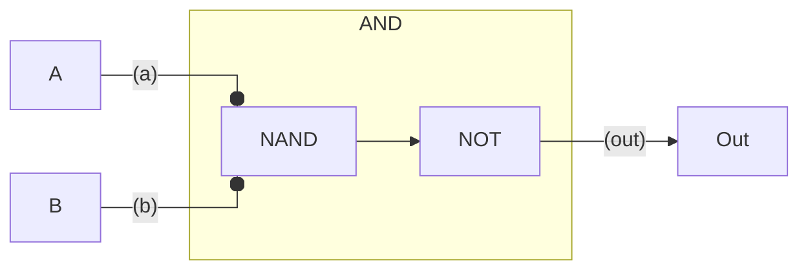

# AND

| a | b | o |
| - | - | - |
| 0 | 0 | 0 |
| 0 | 1 | 0 |
| 1 | 0 | 0 |
| 1 | 1 | 1 |

```mermaid
%%{ init: { 'flowchart': { 'curve': 'stepAfter' } } }%%
graph LR

A --(a)--o NAND
B --(b)--o NAND
NOT --(out)--> Out

subgraph AND
    NAND --> NOT
end
```
