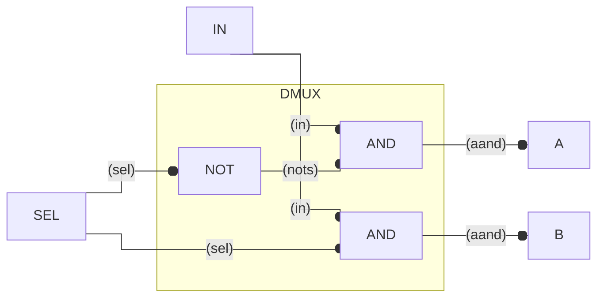

# DMUX

| i | s | a | b |
| - | - | - | - |
| 0 | 0 | 0 | 0 |
| 1 | 0 | 1 | 0 |
| 0 | 1 | 0 | 0 |
| 1 | 1 | 0 | 1 |

```mermaid
%%{ init: { 'flowchart': { 'curve': 'stepAfter' } } }%%
graph LR

IN --(in)--o aand
IN --(in)--o band
SEL --(sel)--o nots
SEL --(sel)--o band

subgraph DMUX
    nots[NOT]
    aand[AND]
    band[AND]

    nots --(nots)--o aand
end

aand --(aand)--o A
band --(aand)--o B
```
