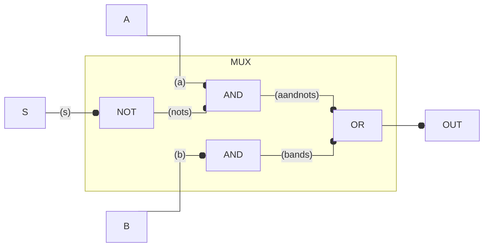

# MUX

| a | b | s | o |
| - | - | - | - |
| 0 | 0 | 0 | 0 |
| 0 | 0 | 1 | 0 |
| 0 | 1 | 0 | 0 |
| 0 | 1 | 1 | 1 |
| 1 | 0 | 0 | 1 |
| 1 | 0 | 1 | 0 |
| 1 | 1 | 0 | 1 |
| 1 | 1 | 1 | 1 |

```mermaid
%%{ init: { 'flowchart': { 'curve': 'stepAfter' } } }%%
graph LR

S --(s)--o nots
A --(a)--o aandnots
B --(b)--o bands

subgraph MUX
    nots[NOT]
    aandnots[AND]
    bands[AND]
    OR

    nots --(nots)--o aandnots
    aandnots --(aandnots)--o OR
    bands --(bands)--o OR   
end

OR --o OUT

```
