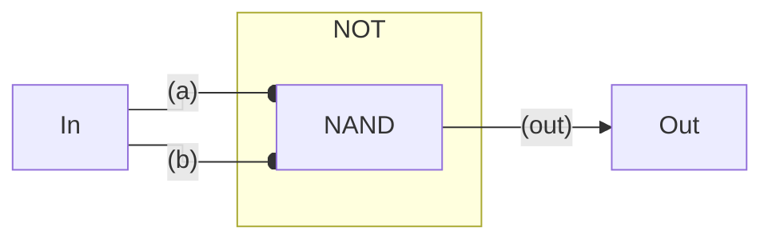

# NOT

| a | o |
| - | - |
| 0 | 1 |
| 1 | 0 |

```mermaid
%%{ init: { 'flowchart': { 'curve': 'stepAfter' } } }%%
graph LR

In --(a)--o NAND
In --(b)--o NAND
NAND --(out)--> Out

subgraph NOT
    NAND
end
```
