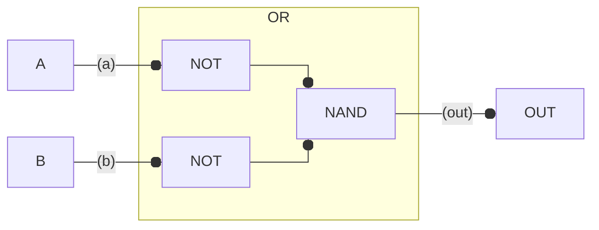

# OR

| a | b | o |
| - | - | - |
| 0 | 0 | 0 |
| 0 | 1 | 1 |
| 1 | 0 | 1 |
| 1 | 1 | 1 |

```mermaid
%%{ init: { 'flowchart': { 'curve': 'stepAfter' } } }%%
graph LR

A --(a)--o nota
B --(b)--o notb
NAND --(out)--o OUT 
subgraph OR
    nota[NOT]
    notb[NOT]
    nota --o NAND
    notb --o NAND
end
```
