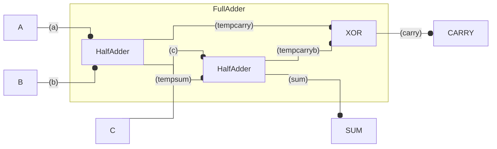

# FullAdder

| a | b | c |sum|carry|
| - | - | - | - | -   |
| 0 | 0 | 0 | 0 |  0  |
| 0 | 0 | 1 | 1 |  0  |
| 0 | 1 | 0 | 1 |  0  |
| 0 | 1 | 1 | 0 |  1  |
| 1 | 0 | 0 | 1 |  0  |
| 1 | 0 | 1 | 0 |  1  |
| 1 | 1 | 0 | 0 |  1  |
| 1 | 1 | 1 | 1 |  1  |

